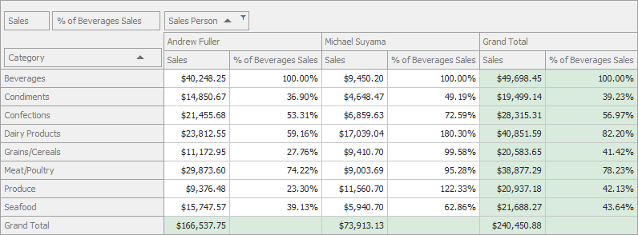

<!-- default badges list -->

<!-- default badges end -->

# How to Use the Other Cell's Values in the Current Cell Value Calculation

This example calculates percentage based on the _Beverages_ row value for each column. The Pivot Grid handles the [PivotGridControl.CustomCellValue](https://docs.devexpress.com/WindowsForms/DevExpress.XtraPivotGrid.PivotGridControl.CustomCellValue) event to display a calculated percentage value in the cell that belongs to the _% of Beverages Sales_ column. The grand total values are hidden.

API in this example:

* [PivotGridControl.CustomCellValue](https://docs.devexpress.com/WindowsForms/DevExpress.XtraPivotGrid.PivotGridControl.CustomCellValue) 
* [e.GetRowFields](https://docs.devexpress.com/CoreLibraries/DevExpress.XtraPivotGrid.PivotCellEventArgsBase-3.GetRowFields) 
* [e.GetColumnFields](https://docs.devexpress.com/CoreLibraries/DevExpress.XtraPivotGrid.PivotCellEventArgsBase-3.GetColumnFields) 
* [e.GetFieldValue](https://docs.devexpress.com/CoreLibraries/DevExpress.XtraPivotGrid.PivotCellEventArgsBase-3.GetFieldValue(-0)) 
* [e.GetCellValue](https://docs.devexpress.com/CoreLibraries/DevExpress.XtraPivotGrid.PivotCellEventArgsBase-3.GetCellValue(System.Object---System.Object----0)) 
* [e.RowValueType](https://docs.devexpress.com/CoreLibraries/DevExpress.XtraPivotGrid.PivotCellEventArgsBase-3.RowValueType) 
* [e.Value](https://docs.devexpress.com/CoreLibraries/DevExpress.XtraPivotGrid.PivotCellEventArgsBase-3.Value)

## Files to Review

[Form1.cs](./CS/WinAppCustomCellValue/Form1.cs) (VB: [Form1.vb](./VB/WinAppCustomCellValue/Form1.vb))

## More Examples 

* [How to Display a Percent Difference from the Previous Parallel Period](https://github.com/DevExpress-Examples/getting-a-summary-value-for-a-previous-period-while-calculating-the-current-one-e2125)
* [Pivot Grid for WinForms - Hide Row Totals](https://github.com/DevExpress-Examples/winforms-pivotgrid-hide-totals-customcellvalue)
